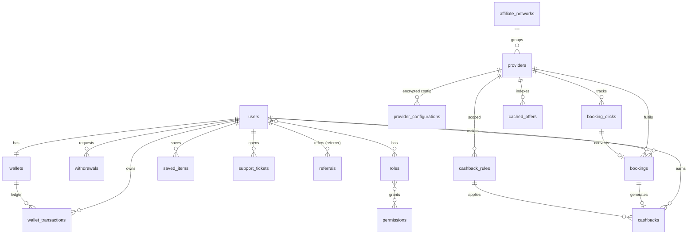

# Database Design (MySQL 8)

## ER overview

## Tables (grouped)

| Group | Tables |
|-------|--------|
| Identity / RBAC | `users`, `roles`, `permissions`, `role_user`, `permission_role`, `user_devices`, `personal_access_tokens` |
| Providers | `affiliate_networks`, `providers`, `provider_configurations` |
| Money | `wallets`, `wallet_transactions`, `cashback_rules`, `cashbacks`, `withdrawals` |
| Funnel | `booking_clicks`, `bookings`, `cached_offers` |
| Engagement | `referrals`, `notifications`, `support_tickets`, `support_messages`, `saved_items` |
| Ops | `search_logs`, `audit_logs`, `settings` |

## Design decisions

- **Money:** all amounts `DECIMAL(15,2)` + explicit `currency`. `wallets.balance` and
  `pending_balance` are cached projections of the `wallet_transactions` ledger.
- **Secrets at rest:** `provider_configurations.config`, `withdrawals.payout_details`,
  `affiliate_networks.postback_secret`, `users.mfa_secret` use Laravel `encrypted` casts.
- **Idempotency:** `wallet_transactions.idempotency_key` is unique; `bookings` is unique on
  `(provider_id, external_ref)`; a user can be referred only once (`referrals.referee_id` unique).
- **Soft deletes** on `users` and `providers`; full `audit_logs` for privileged mutations.

## Index strategy (high-volume aware)

| Table | Indexes | Why |
|-------|---------|-----|
| `cached_offers` | `(category, price)`, `(category, destination, price)`, `offer_hash` unique | Sorted/filterable search reads at scale |
| `search_logs` | `(category, created_at)`, `session_id`, `created_at` | Analytics + abuse detection, append-heavy |
| `wallet_transactions` | `(user_id, type)`, `created_at`, `idempotency_key` unique | Ledger queries + double-post prevention |
| `cashbacks` | `status`, `(user_id, status)` | Maturation sweeps + user views |
| `bookings` | `(provider_id, external_ref)` unique, `(user_id, status)`, `category` | Idempotent postbacks + dashboards |
| `booking_clicks` | `click_id` unique, `(provider_id, created_at)`, `session_id` | Attribution lookups |
| `providers` | `is_active`, `priority` | Fast active-provider fan-out |
| `audit_logs` | `(action, created_at)` | Compliance queries |

`search_logs`, `audit_logs` and `cached_offers` are the growth tables — designed for
monthly partitioning / archival when volume warrants it.

## Seed data
`php artisan migrate --seed` loads: RBAC (admin/manager/support/user + permissions),
public settings, 9 reference providers (demo mode) across all categories, 3 cashback rules
(global 40%, hotels 60%, MakeMyTrip flights flat ₹250), and demo admin/user accounts.
